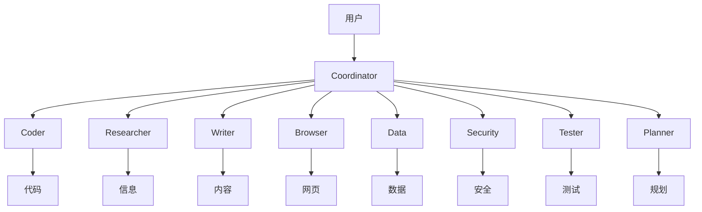
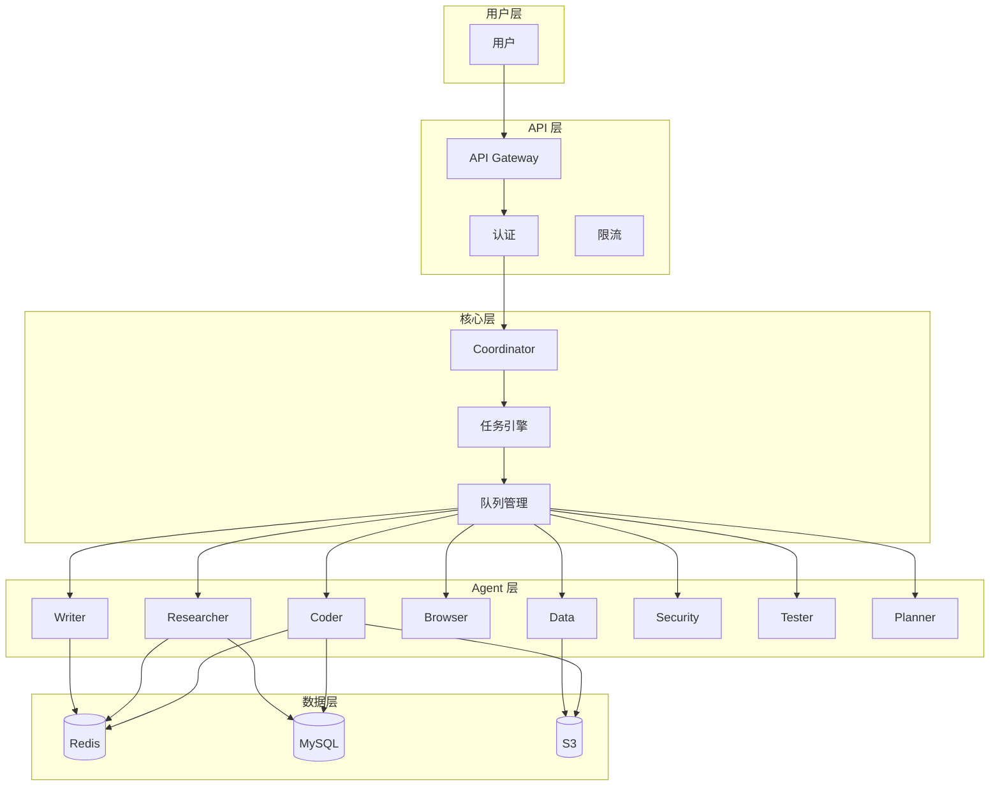
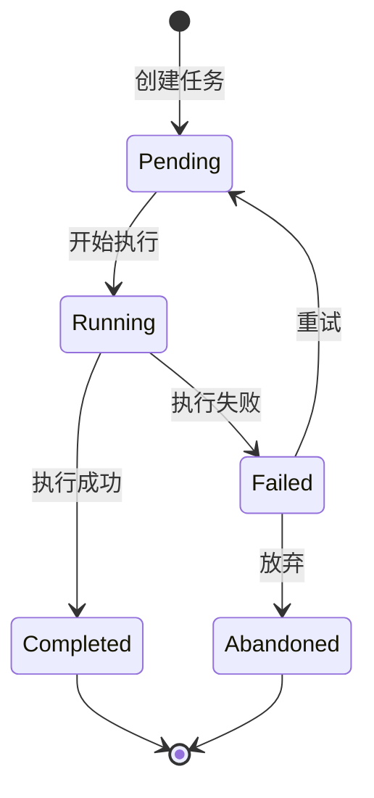
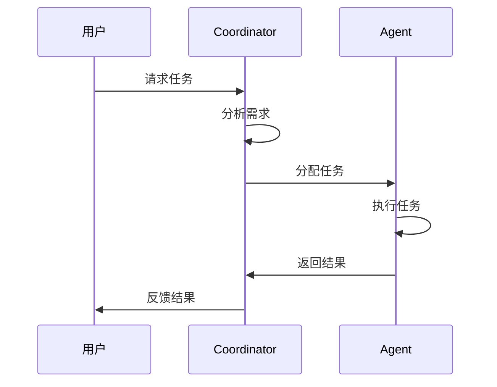
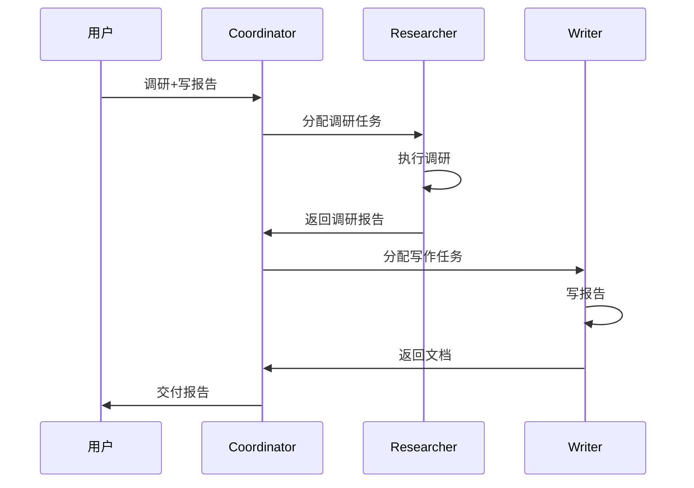
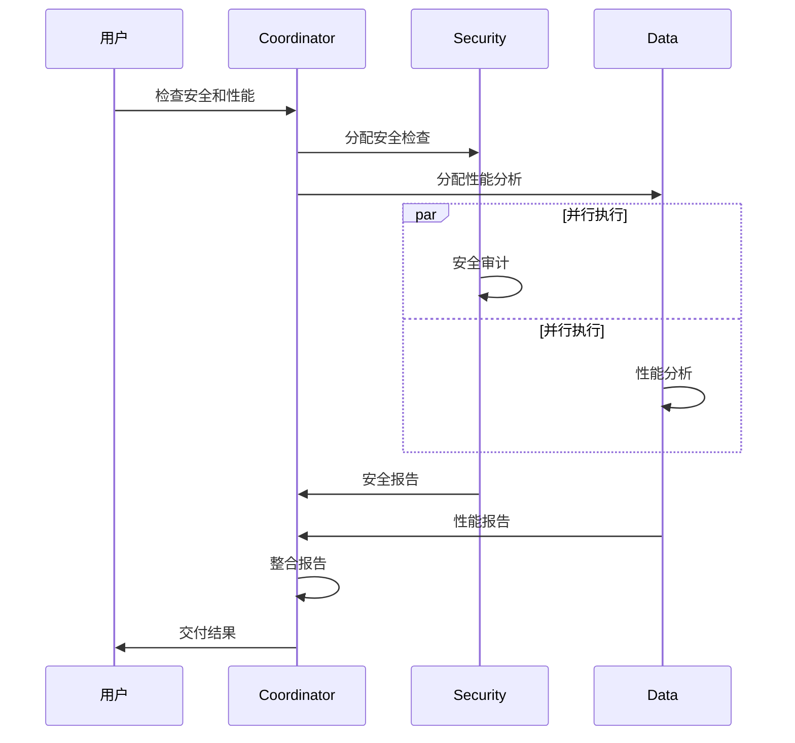
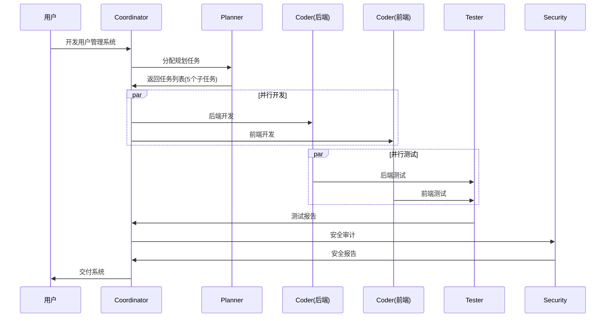
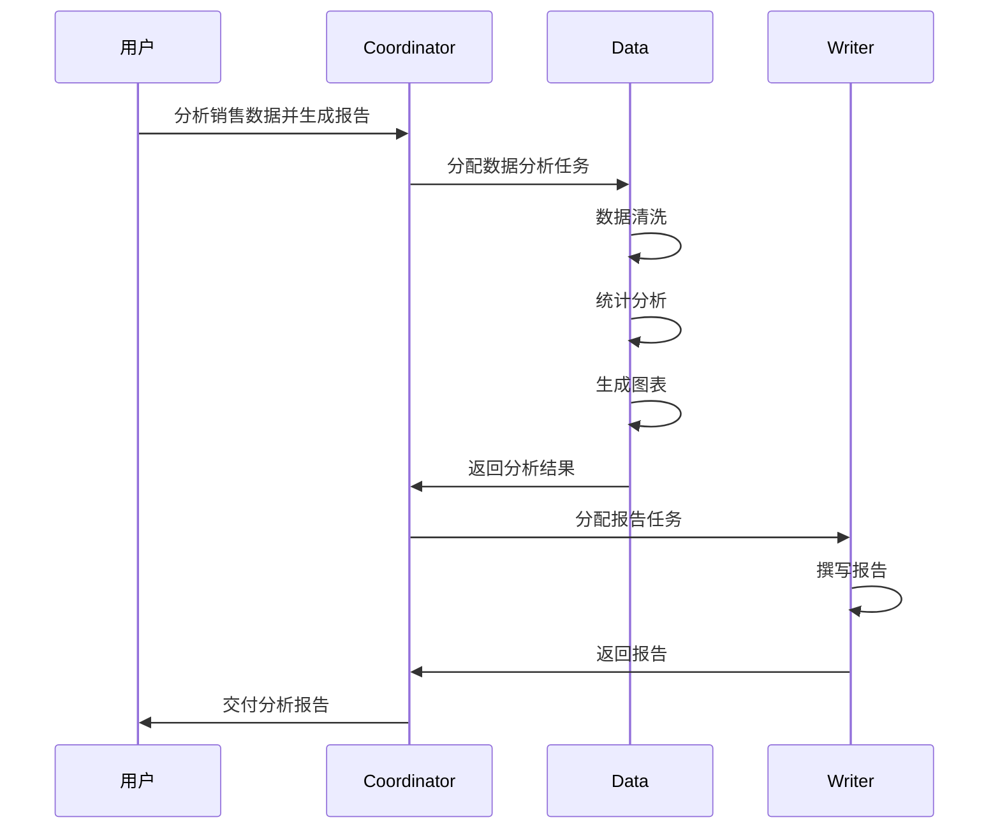

# Agent Framework 核心架构

> 角色定义、架构设计、协作流程 - AI 友好的结构化文档
> 版本: 2026-02-21 v3.0

---

## 目录

1. [角色定义 (AI可直接读取)](#1-角色定义-ai可直接读取)
2. [架构设计](#2-架构设计)
3. [协作流程](#3-协作流程)
4. [Provider 对比](#4-provider-对比)
5. [快速配置](#5-快速配置)

---

## 1. 角色定义 (AI可直接读取)

### 角色元数据 (JSON格式 - AI可直接解析)

```json
{
  "roles": {
    "coordinator": {
      "id": "coordinator",
      "name": "Coordinator",
      "emoji": "🧭",
      "description": "协调者 - 任务分配和流程控制",
      "primary_model": "claude-3.5-sonnet",
      "capabilities": ["task_decomposition", "agent_selection", "result_acceptance"],
      "inputs": ["user_message", "system_event"],
      "outputs": ["task_assignment", "user_feedback"],
      "must_do": [
        "确认需求后再分配任务",
        "明确验收标准",
        "及时反馈进度"
      ],
      "must_not_do": [
        "不确认需求就分配",
        "跳过验收直接反馈"
      ]
    },
    "coder": {
      "id": "coder",
      "name": "Coder",
      "emoji": "💻",
      "description": "代码开发 - 写代码、改bug、测试",
      "primary_model": "claude-3.5-sonnet",
      "fallback_models": ["gpt-4o", "deepseek-coder"],
      "capabilities": ["code_generation", "debugging", "refactoring", "test_writing"],
      "inputs": ["requirement", "language", "existing_code"],
      "outputs": ["code_file", "test_file"],
      "supported_languages": ["python", "javascript", "typescript", "go", "rust", "java"]
    },
    "researcher": {
      "id": "researcher",
      "name": "Researcher",
      "emoji": "🔍",
      "description": "调研分析 - 搜索、整理、报告",
      "primary_model": "gpt-4o",
      "fallback_models": ["gemini-1.5-flash", "kimi"],
      "capabilities": ["information_search", "data_organization", "report_generation"],
      "inputs": ["topic", "scope", "format"],
      "outputs": ["report", "data"]
    },
    "writer": {
      "id": "writer",
      "name": "Writer",
      "emoji": "✍️",
      "description": "内容创作 - 写作、翻译、润色",
      "primary_model": "claude-3.5-sonnet",
      "fallback_models": ["gpt-4o", "kimi", "glm-4"],
      "capabilities": ["document_writing", "translation", "editing"],
      "inputs": ["topic", "style", "audience"],
      "outputs": ["document"]
    },
    "browser": {
      "id": "browser",
      "name": "Browser",
      "emoji": "🌐",
      "description": "浏览器自动化 - 网页操作、数据抓取",
      "primary_model": "gpt-4o",
      "capabilities": ["web_automation", "content_extraction", "screenshot"],
      "inputs": ["url", "actions"],
      "outputs": ["data", "screenshot"]
    },
    "data": {
      "id": "data",
      "name": "Data",
      "emoji": "📊",
      "description": "数据分析 - 统计、可视化、报告",
      "primary_model": "gpt-4o",
      "capabilities": ["data_cleaning", "statistical_analysis", "visualization"],
      "inputs": ["data_file", "analysis_type"],
      "outputs": ["report", "chart"]
    },
    "security": {
      "id": "security",
      "name": "Security",
      "emoji": "🔒",
      "description": "安全审计 - 代码审计、漏洞扫描",
      "primary_model": "claude-3.5-sonnet",
      "capabilities": ["security_audit", "vulnerability_scanning", "risk_assessment"],
      "inputs": ["code", "scope"],
      "outputs": ["security_report"]
    },
    "tester": {
      "id": "tester",
      "name": "Tester",
      "emoji": "🧪",
      "description": "测试工程 - 单元测试、集成测试",
      "primary_model": "claude-3.5-sonnet",
      "capabilities": ["unit_test", "integration_test", "bug_reproduction"],
      "inputs": ["code", "test_type"],
      "outputs": ["test_file", "test_report"]
    },
    "planner": {
      "id": "planner",
      "name": "Planner",
      "emoji": "📅",
      "description": "项目规划 - 任务拆解、进度规划",
      "primary_model": "gpt-4o",
      "capabilities": ["task_decomposition", "priority_ranking", "schedule_planning"],
      "inputs": ["project", "goal", "constraints"],
      "outputs": ["plan", "timeline"]
    }
  }
}
```

### 角色能力矩阵



---

## 2. 架构设计

### 整体架构



### 任务状态机



---

## 3. 协作流程

### 流程 1: 直接执行



### 流程 2: 串行协作



### 流程 3: 并行协作



### 任务分配规则

```json
{
  "routing_rules": {
    "写代码": ["coder"],
    "改bug": ["coder"],
    "调研": ["researcher"],
    "写文档": ["writer"],
    "翻译": ["writer"],
    "数据分析": ["data"],
    "抓取网页": ["browser"],
    "安全检查": ["security"],
    "写测试": ["tester"],
    "项目规划": ["planner"],
    "复杂任务": ["coordinator -> 多个Agent"]
  }
}
```

### 完整协作示例

#### 示例 1: 复杂项目 - 用户系统



#### 示例 2: 数据分析流程



---

## 4. Provider 对比

### Model 推荐表

| 场景 | 推荐 Model | 备选 | 价格 |
|------|-----------|------|------|
| 代码开发 | claude-3.5-sonnet | gpt-4o, deepseek-coder | $$ |
| 写作 | claude-3.5-sonnet | gpt-4o, kimi | $$ |
| 调研 | gpt-4o | gemini-1.5-flash, kimi | $-$$ |
| 通用/协调 | gpt-4o | claude-3.5, gemini-flash | $$ |
| 性价比 | gemini-1.5-flash | deepseek-coder | $ |
| 中文场景 | kimi | glm-4 | $ |
| 本地部署 | llama-3.1-70b | qwen2.5 | 免费 |

### Provider 快速选择

```json
{
  "provider_selection": {
    "default": "openai/gpt-4o",
    "code": "anthropic/claude-3.5-sonnet",
    "chinese": "moonshot/kimi",
    "cheap": "google/gemini-1.5-flash",
    "local": "meta/llama-3.1-70b"
  }
}
```

---

## 5. 快速配置

### 最小配置 (JSON)

```json
{
  "agents": [
    {
      "id": "coordinator",
      "model": "gpt-4o",
      "role": "coordinator"
    },
    {
      "id": "coder", 
      "model": "claude-3.5-sonnet",
      "role": "coder"
    },
    {
      "id": "researcher",
      "model": "gpt-4o",
      "role": "researcher"
    },
    {
      "id": "writer",
      "model": "claude-3.5-sonnet",
      "role": "writer"
    }
  ],
  "providers": {
    "openai": { "api_key": "${OPENAI_API_KEY}" },
    "anthropic": { "api_key": "${ANTHROPIC_API_KEY}" }
  }
}
```

### 完整配置模板

```yaml
# 完整 Agent 配置
system:
  name: "agent-system"
  version: "3.0"
  
agents:
  coordinator:
    enabled: true
    model: "gpt-4o"
    timeout: 300
    
  coder:
    enabled: true
    model: "claude-3.5-sonnet"
    fallback: "gpt-4o"
    timeout: 600
    languages: ["python", "javascript", "go"]
    
  researcher:
    enabled: true
    model: "gpt-4o"
    timeout: 300
    
  writer:
    enabled: true
    model: "claude-3.5-sonnet"
    timeout: 300

providers:
  openai:
    enabled: true
    api_key: "${OPENAI_API_KEY}"
    
  anthropic:
    enabled: true
    api_key: "${ANTHROPIC_API_KEY}"
    
  google:
    enabled: true
    api_key: "${GOOGLE_API_KEY}"

tasks:
  queue: "redis://localhost:6379"
  max_retries: 3
  default_timeout: 300
```

---

## AI 快速读取指南

### 给 AI Agent 用的简明指令

```
你是 Agent 系统，请按以下步骤执行：

1. 理解用户需求
2. 选择合适的 Agent：
   - 代码 → coder
   - 调研 → researcher  
   - 写作 → writer
   - 数据 → data
   - 安全 → security
   - 测试 → tester
   - 规划 → planner
3. 分配任务，设置验收标准
4. 等待执行结果
5. 验收后反馈用户
```

---

## 待验证清单

> 以下内容需要在实际环境中验证后才能确认其正确性

### 需要验证的项目

| # | 验证项 | 文档位置 | 状态 |
|---|--------|---------|------|
| 1 | 角色定义 JSON 格式是否正确解析 | 01_core_architecture.md | ⏳ 待验证 |
| 2 | Mermaid 图表是否正确渲染 | 01_core_architecture.md | ⏳ 待验证 |
| 3 | 任务分配规则是否准确 | 01_core_architecture.md | ⏳ 待验证 |
| 4 | Docker Compose 配置是否可运行 | 02_operations_guide.md | ⏳ 待验证 |
| 5 | K8s 配置是否可部署 | 02_operations_guide.md | ⏳ 待验证 |
| 6 | 监控告警阈值是否合理 | 02_operations_guide.md | ⏳ 待验证 |
| 7 | 测试用例代码是否可运行 | 03_testing_verification.md | ⏳ 待验证 |
| 8 | CI/CD 配置是否正确 | 03_testing_verification.md | ⏳ 待验证 |

### 验证方法

```
验证步骤：

1. 角色定义验证
   - 读取 JSON 部分
   - 用代码解析确认格式正确
   
2. 架构验证
   - 部署最小系统
   - 验证任务流转
   
3. 配置验证
   - 运行 Docker Compose
   - 验证服务启动
   
4. 测试验证
   - 运行测试用例
   - 确认通过/失败
```

---

*文档版本: 2026-02-21 v3.1*
*更新: 添加完整协作示例 + 待验证清单*
